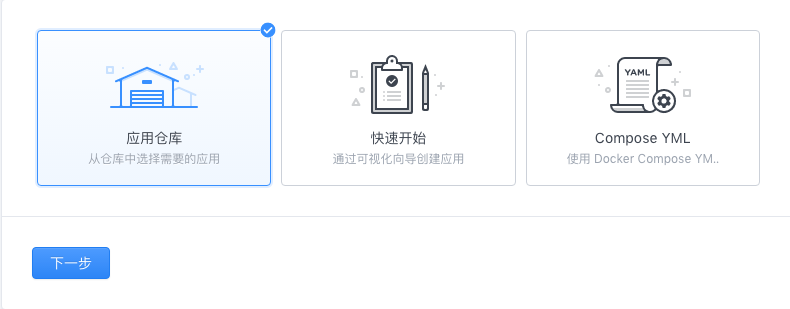
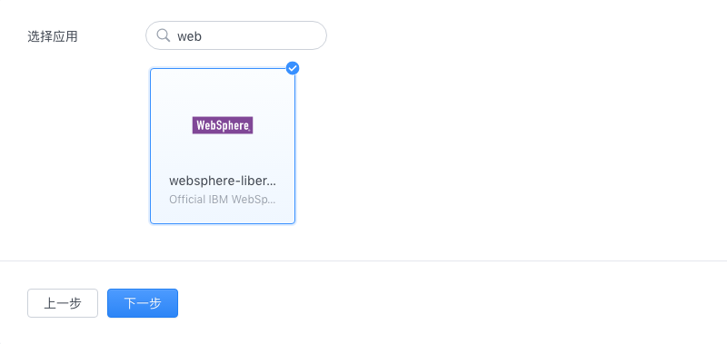
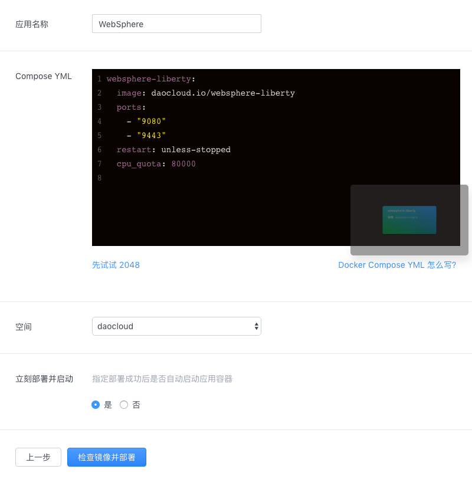
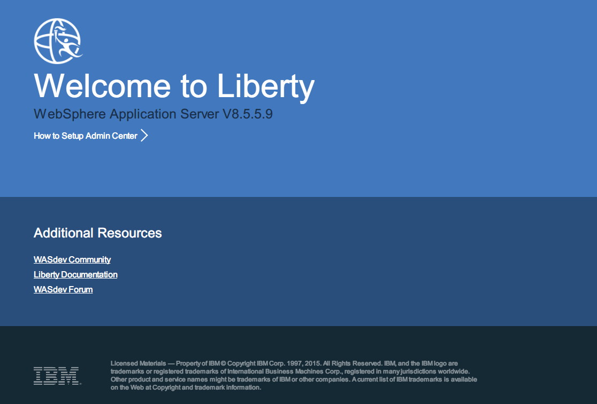

# WebSphere 的 DCE 解决方案

## 解决方案介绍

WebSphere 是企业中比较常见的一个软件平台，可进行部署 Web 应用和一些中间件。IBM 提供了官方的 Docker 镜像，可用于直接部署，或作为基础镜像构建应用镜像。

## 安装

1. 在「应用」中选择「创建」，选择用「镜像仓库」的方式来创建应用。

    
2. 选择 websphere 应用。

    
3. 输入「应用名称」，点击「检查镜像并部署」。

    
4. 创建好应用后在「概览」标签下可以看到 WebSphere 的访问地址。

    
5. 点击访问地址后打开 WebSphere 页面。

    


## 使用

1. 编写 Dockerfile，将 Sample1.war 构建到镜像内 /config/dropins 文件夹下。

    `Dockerfile`
    ```
    FROM websphere-liberty:8.5.5.9-webProfile7
    ADD Sample1.war /config/dropins
    ```

2. 构建镜像。

        docker build -t app .

3. 通过「快速开始」或「Compose YML」方式创建应用，最终 YML 配置类似如下。

    ```yaml
    version: '2'
    services:
      websphere-liberty:
        image: app
        ports:
          - "9080"
          - "9443"
    ```

4. 部署应用后「概览」标签下可以看到 WebSphere 的访问地址。
